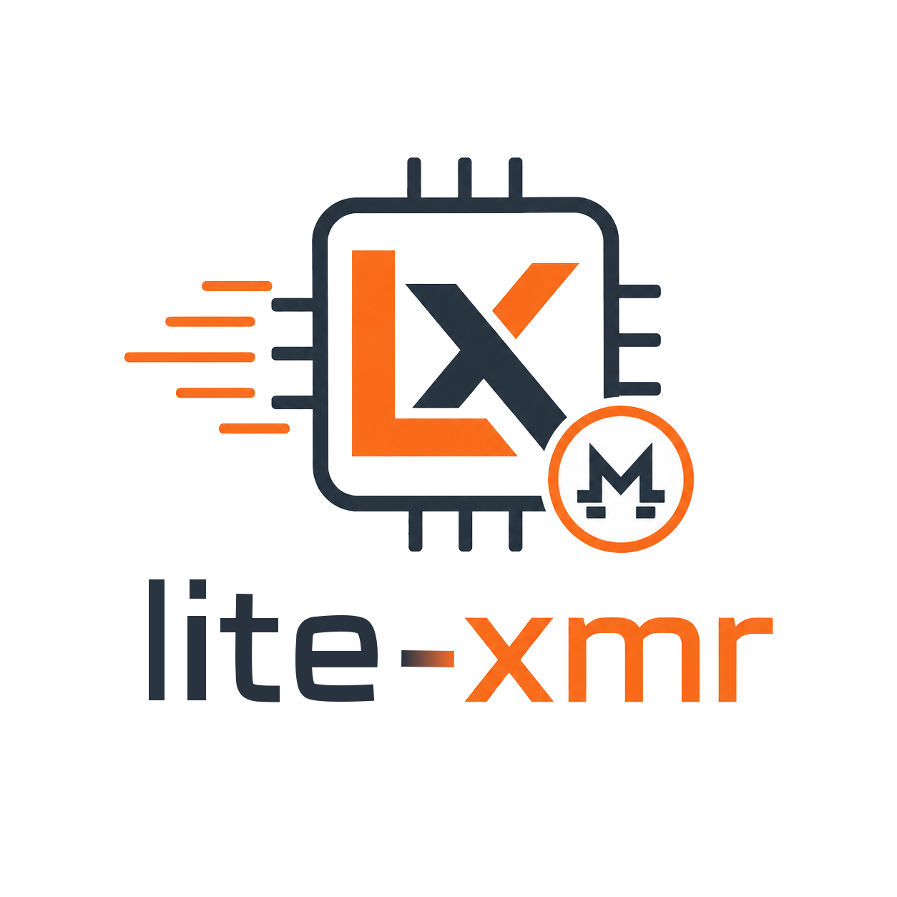

# lite-xmr

<div align="center">




**A compact Monero (XMR) CPU miner written mostly in Rust, with RandomX native code where it matters.**

</div>

---

## What This Is

`lite-xmr` is a lightweight Monero CPU miner focused on a small Rust control plane, Stratum pool connectivity, and RandomX mining through native code.

It is not a "pure Rust, no C/C++" project. The miner intentionally uses native dependencies where they are the practical choice:

- `randomx-rs` provides RandomX through C/C++ FFI.
- `src/crypto/randomx/*` keeps the local RandomX headers needed for compatibility checks.
- `src/3rdparty/rapidjson` is used by a small native bridge for tolerant Stratum JSON handling.
- Windows TLS fallback uses vendored OpenSSL to match XMRig-style pool compatibility.

## Current Scope

- Monero RandomX `rx/0`.
- CPU mining only.
- Stratum over TCP or TLS.
- Optional TLS SNI override for proxy and fronting setups.
- x86_64-focused CPU detection and thread planning.
- Optional DNS fallback/DoH-style resolver path for unstable DNS environments.
- HTTP/2, HTTP/3, and WebSocket capability flags for compatible proxies.
- Zero developer fee.

This is a focused miner, not a full XMRig replacement. OpenCL, CUDA, MSR tuning, huge-page privilege management, and multi-algorithm switching are outside the current scope.

## TLS And xmrig-proxy

Some private `xmrig-proxy` deployments are TLS-only. If you connect without TLS, the proxy can immediately close the socket with EOF.

Use `--tls` for those pools:

```bash
lite-xmr -o HOST:PORT -u YOUR_WALLET -p x --tls
```

TLS 1.2-only endpoints are supported by opting in to legacy protocol negotiation:

```powershell
lite-xmr -o 156.226.168.60:36807 -u YOUR_WALLET -p x --tls --tls-allow-12
```

Connection-only test, with debug logs and no mining:

```bash
lite-xmr -o HOST:PORT -u x -p x --tls -k -V
```

On Windows, `lite-xmr` tries rustls first and then falls back to OpenSSL when a pool behaves like XMRig-compatible TLS endpoints. This is important for private proxies with self-signed certificates or non-browser-style TLS behavior.

If the TCP address and TLS virtual host need to differ, override the SNI server name:

```bash
lite-xmr -o x.x.x.x:443 -u YOUR_WALLET --tls --sni proxy.example.com
```

Security note: for XMRig-style pool compatibility, lite-xmr still accepts self-signed or otherwise untrusted pool certificates unless a certificate pin is provided. Use `--tls-fingerprint <SHA256>` to verify the pool certificate fingerprint and prevent silent man-in-the-middle redirection.

```powershell
lite-xmr -o HOST:PORT -u YOUR_WALLET --tls --tls-fingerprint AA:BB:CC:...
```

If your pool is reachable only through a local or remote SOCKS5 proxy:

```powershell
lite-xmr -o HOST:PORT -u YOUR_WALLET --tls --socks5 127.0.0.1:1080
```

## Quick Start

```bash
lite-xmr -o pool.supportxmr.com:3333 -u YOUR_WALLET
```

With TLS:

```bash
lite-xmr -o pool.supportxmr.com:443 -u YOUR_WALLET --tls
```

With explicit threads:

```bash
lite-xmr -o pool.supportxmr.com:443 -u YOUR_WALLET --tls -t 8
```

Benchmark locally:

```bash
lite-xmr --bench 30
```

## Command Line

| Option | Meaning |
| --- | --- |
| `-o, --url, --pool <HOST:PORT>` | Pool address. Schemes such as `stratum+tls://`, `tls://`, `ssl://`, and `https://` imply TLS. |
| `-u, --user <ADDRESS>` | Wallet address or pool username. |
| `-p, --pass <STRING>` | Pool password, defaulting to `x` when omitted. |
| `-t, --threads <N>` | Mining threads. `0` means automatic thread planning. |
| `--tls` | Force TLS for the pool connection. |
| `--tls-allow-12` | Allow TLS 1.2 when connecting to older pools or TLS terminators. |
| `--tls-fingerprint <SHA256>` | Pin the pool certificate by SHA-256 fingerprint. Colons are accepted. |
| `--sni <HOST>` | Override the TLS SNI server name sent during handshake. |
| `--socks5 <HOST:PORT>` | Connect to the pool through a no-auth SOCKS5 proxy. |
| `--miner-signature <SIG>` | Include `sig` in Stratum login params for pools that require miner signatures. |
| `-ua, --ua <MODE>` | Select the Stratum login User-Agent preset. |
| `--http2` | Add `http2: true` to the Stratum login params. |
| `--http3` | Add `http3: true` to the Stratum login params. |
| `--ws` | Add `ws: true` to the Stratum login params. |
| `--config <PATH>` | Load `config.toml` or `config.json`. |
| `--log-level <LEVEL>` | Set log level, for example `info`, `debug`, or `warn`. |
| `-V, --verbose` | Shortcut for `--log-level debug`. |
| `-k, --keepalive` | Connect and keep the session alive without mining. Useful for proxy/TLS checks. |
| `--doh` | Resolve the pool host through the built-in resolver path before connecting. |
| `--use-e-cores` | Include E-cores in automatic thread planning on hybrid CPUs. |
| `-B, --background` | Run in background mode. |
| `--bench <SECONDS>` | Run local RandomX benchmark. |
| `-v, --version` | Print version and exit. |
| `-h, --help` | Print help and exit. |

## User-Agent Presets

`-ua` changes the `params.agent` value sent in the Stratum `login` request.

| Mode | User-Agent |
| --- | --- |
| default | `XMRig/6.26.0 (Windows NT 10.0; Win64; x64)` |
| edge | `Mozilla/5.0 (Windows NT 10.0; Win64; x64) AppleWebKit/537.36 (KHTML, like Gecko) Chrome/149.0.0.0 Safari/537.36 Edg/149.0.0.0` |
| full | `XMRig/6.26.0 (Windows NT 10.0; Win64; x64) libuv/1.51.0 msvc/2022 lite-xmr/1.2.0-alpha.1 rust/2022` |
| xmrig | `XMRig/6.26.0 (Windows NT 10.0; Win64; x64) libuv/1.51.0 msvc/2022` |
| fast | `lite-xmr/1.2.0-alpha.1 rust/2022` |
| short | `lite-xmr/1.2.0-alpha.1` |
| sogo | `Mozilla/5.0 (Windows NT 6.1; WOW64) AppleWebKit/537.36 (KHTML, like Gecko) Chrome/49.0.2623.221 Safari/537.36 SE 2.X MetaSr 1.0` |
| ie11 | `Mozilla/5.0 (Windows NT 6.1; WOW64; Trident/7.0; rv:11.0) like Gecko` |

Examples:

```bash
lite-xmr -o HOST:PORT -u YOUR_WALLET --tls -ua xmrig
lite-xmr -o HOST:PORT -u YOUR_WALLET --tls -ua edge --http2 --http3 --ws
```

`--http2`, `--http3`, and `--ws` are advertised pool/proxy capability flags in the login params. They do not turn Stratum TCP into HTTP/2, HTTP/3/QUIC, or a WebSocket transport by themselves; use them only with proxies that understand those flags.

The `http3://` and `h3://` URL schemes imply TLS and set the HTTP/3 capability flag. The `ws://` and `wss://` schemes set the WebSocket capability flag, and `wss://` also implies TLS.

## Configuration File

`lite-xmr` looks for `config.toml` or `config.json` in the current directory unless `--config` is provided.

XMRig-style `config.json` files are accepted. `lite-xmr` reads the first enabled pool from `pools`, supports XMRig pool keys such as `url`, `user`, `pass`, `enabled`, `tls`, `sni`, and `keepalive`, and maps top-level `http`, `cpu`, `background`, `verbose`, and `user-agent` settings where they match lite-xmr features. XMRig-only GPU, RandomX tuning, daemon, proxy, and TLS certificate fields are ignored safely.

Minimal `config.toml`:

```toml
[pool]
url = "pool.supportxmr.com:443"
user = "YOUR_WALLET"
pass = "x"
tls = true
```

Private TLS proxy test:

```toml
[pool]
url = "HOST:PORT"
user = "x"
pass = "x"
tls = true
sni = "proxy.example.com"
keepalive = true
ua = "xmrig"
http2 = true
http3 = true
ws = true

[logging]
level = "debug"
```

CPU and resolver options:

```toml
use_e_cores = false

[pool]
url = "pool.supportxmr.com:443"
user = "YOUR_WALLET"
tls = true
doh = true

[cpu]
threads = 8
```

## Build From Source

Clone from GitHub:

```bash
git clone https://github.com/koharachan/lite-xmr.git
cd lite-xmr
cargo build --release
```

The binary is written to:

```text
target/release/lite-xmr
```

### Toolchain Requirements

- Rust 1.85 or newer for edition 2024 support.
- C and C++ build tools for `randomx-rs`.
- CMake for native RandomX builds.
- Perl for vendored OpenSSL builds.
- NASM is recommended on Windows for faster OpenSSL assembly builds.

### Windows Notes

Use an MSVC developer shell, for example "x64 Native Tools Command Prompt" or a terminal initialized through `vcvars64.bat`.

Example:

```cmd
call "C:\Program Files\Microsoft Visual Studio\18\Community\VC\Auxiliary\Build\vcvars64.bat"
cargo build --release
```

If OpenSSL vendored build fails, install Perl such as Strawberry Perl and make sure it is in `PATH`.

### Linux Notes

Install a normal native build stack before running Cargo:

```bash
sudo apt install build-essential cmake pkg-config perl nasm
cargo build --release
```

### macOS Notes

Install the Xcode command-line tools:

```bash
xcode-select --install
cargo build --release
```

## Project Layout

```text
src/
├── app/                 CLI entry, logging, benchmark, daemon helpers
├── bridge/              C++ native bridge for RapidJSON and header checks
├── crypto/randomx/      RandomX headers kept for compatibility validation
├── 3rdparty/rapidjson/  RapidJSON headers used by the native bridge
├── randomx/             Rust wrapper logic around RandomX state
├── stratum/             Stratum client and TCP/TLS transport
├── config.rs            CLI and config-file parsing
├── controller.rs        miner orchestration
├── cpu.rs               CPU detection and thread planning
├── job.rs               pool job parsing
├── miner.rs             mining workers and benchmark path
└── stats.rs             hashrate and share counters
```

## Dependency Policy

The repository intentionally keeps only native code that is currently used.

Kept:

- `src/3rdparty/rapidjson`
- `src/crypto/randomx/randomx.h`
- `src/crypto/randomx/configuration.h`
- `src/crypto/randomx/intrin_portable.h`
- `src/crypto/randomx/blake2/endian.h`

Removed:

- unused `getopt`
- unused `argon2`
- unused `base32`
- unused XMRig-side source trees not called by this Rust binary

## Troubleshooting

### Pool closes with EOF

Try TLS:

```bash
lite-xmr -o HOST:PORT -u YOUR_WALLET --tls -V
```

For TLS-only `xmrig-proxy`, plain TCP is expected to fail.

### `-V` does not print version

That is intentional. `-V` means verbose/debug logs. Use `-v` or `--version` for the version.

### Low hashrate

RandomX performance depends heavily on CPU cache, memory timings, huge pages, thread count, and whether the process is pinned to good cores. Start with:

```bash
lite-xmr --bench 30
```

Then try explicit thread counts:

```bash
lite-xmr --bench 30 -t 4
lite-xmr --bench 30 -t 8
lite-xmr --bench 30 -t 12 --use-e-cores
```

Performance checklist:

- Run from an elevated shell on Windows when testing huge-page allocation behavior.
- Keep one mining thread per physical core as the first baseline, then compare `--use-e-cores` separately on hybrid CPUs.
- Close memory-heavy apps before dataset initialization; RandomX full mode needs roughly 2 GiB for the shared dataset plus scratchpads.
- Compare changes with `--bench 30` after each setting so noisy pool-side share timing does not hide local hashrate changes.

### Windows build cannot find MSVC tools

Build from an MSVC developer shell or initialize the environment with `vcvars64.bat`.

### OpenSSL build fails on Windows

Install Perl and ensure `perl.exe` is available in `PATH`. NASM is also recommended.

## License

This project is licensed under [GPL-3.0](LICENSE).

## Disclaimer

This software is provided for learning, experimentation, and legitimate mining use. Mining consumes power, generates heat, and can wear hardware. Follow local laws and only connect to pools or proxies you trust.
